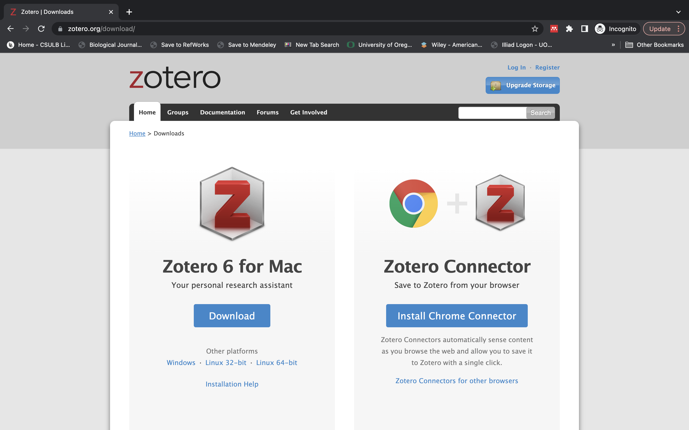
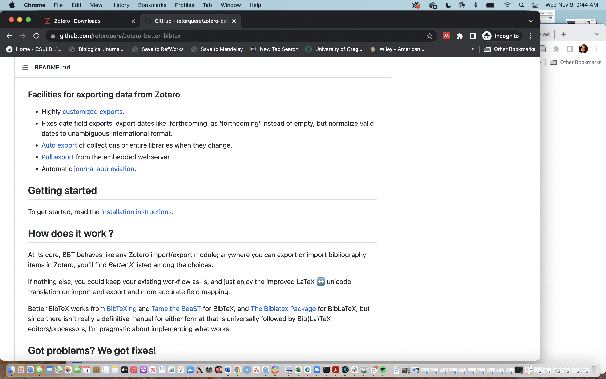
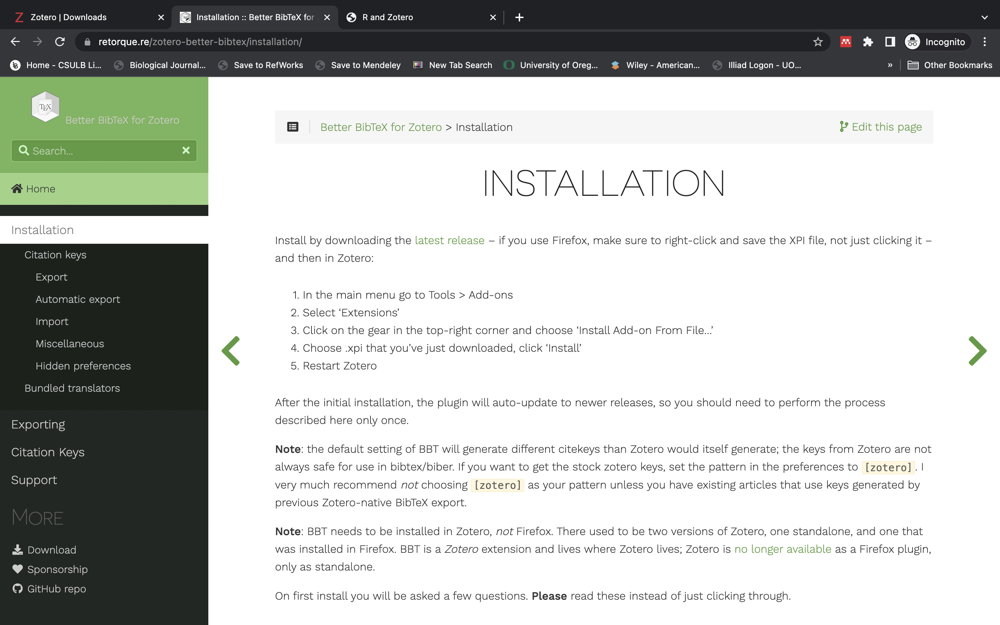
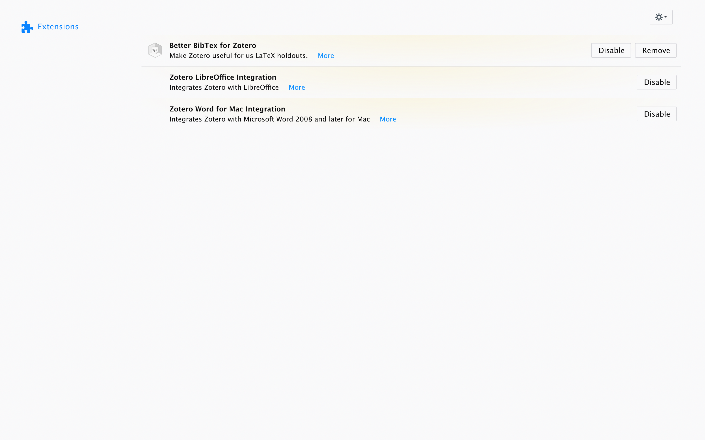
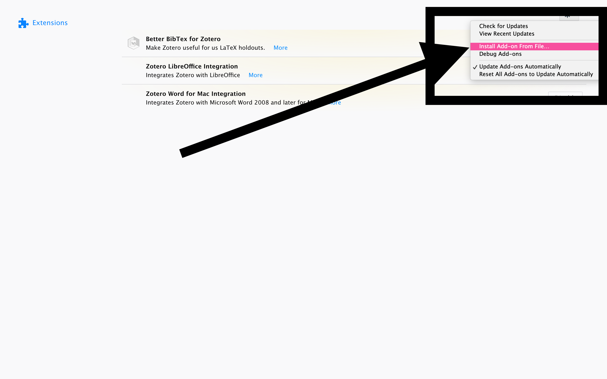
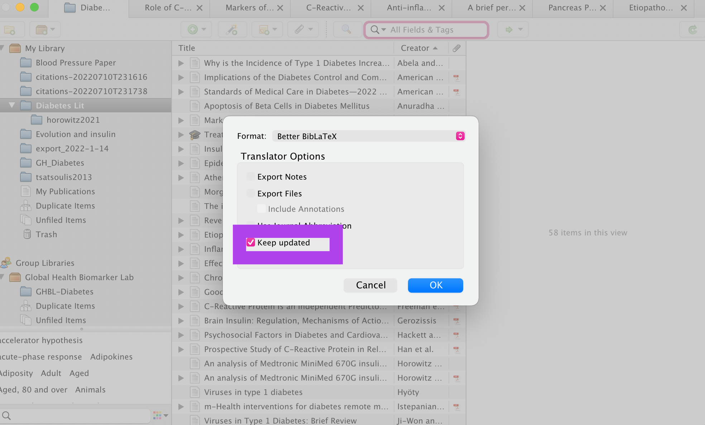
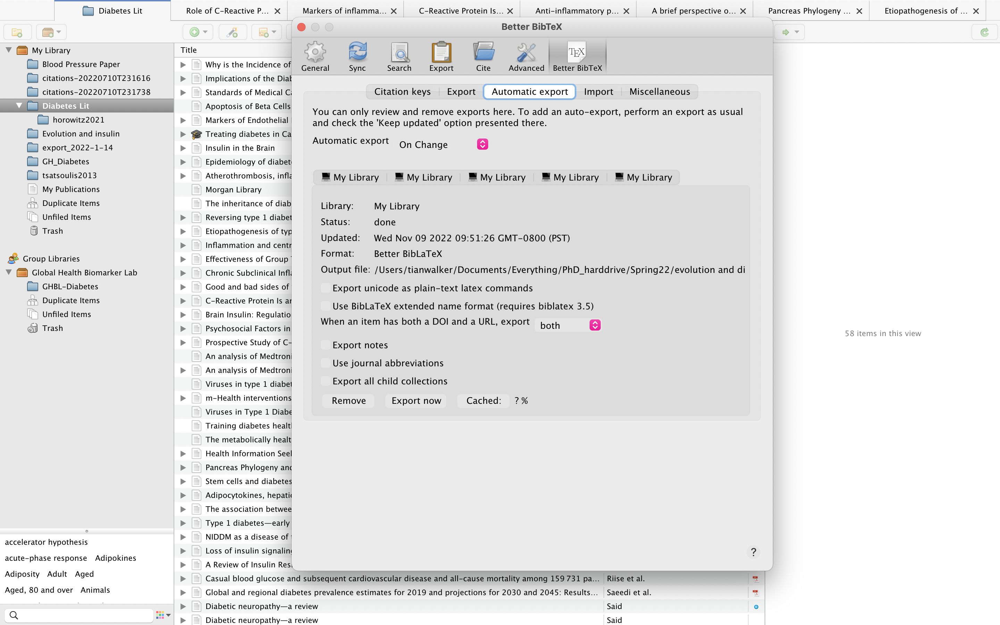
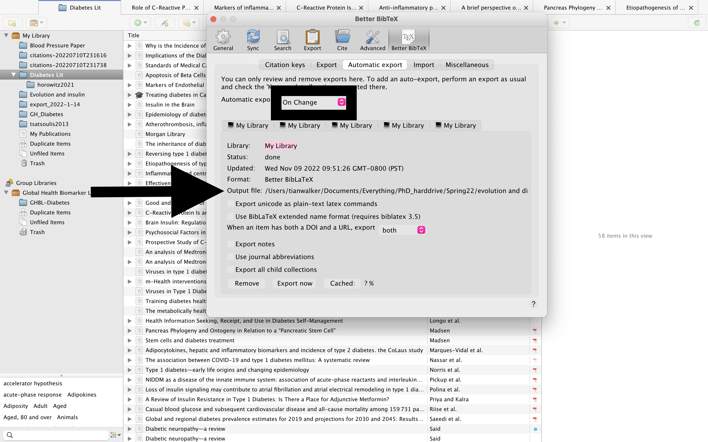
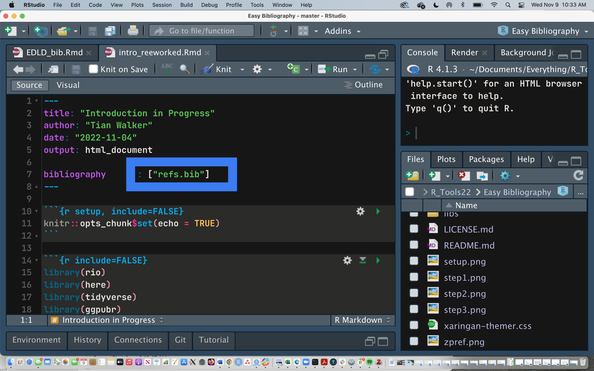

```{r setup, include=FALSE}
options(htmltools.dir.version = FALSE)

knitr::opts_chunk$set(echo = TRUE,
                      message = FALSE,
                      warning = FALSE,
                      cache = TRUE,
                      fig.width = 12)

library(xaringan)
library(xaringanExtra)
library(xaringanthemer)
library(tidyverse)
library(knitr)
library(here)
library(kableExtra)

```

```{r xaringan-themer, include=FALSE, warning=FALSE}
library(xaringanthemer)

style_duo_accent(
  primary_color = "#3e1f79",
  secondary_color = "#791f5e",
  header_font_google = xaringanthemer::google_font("Atkinson Hyperlegible", "600"),
  text_font_google   = xaringanthemer::google_font("Atkinson Hyperlegible", "300", "300i"),
  code_font_google   = xaringanthemer::google_font("IBM Plex Mono"),
  colors = c(
    darkblue = "#0072B2",
    lightblue = "#56B4E9",
    darkorange = "#D55E00",
    lightorange = "#E69f00",
    yellow = "#f0e442",
    green = "#009E73",
    pink = "#CC79A7",
    gray = "#99999",
    white = "#FFFFFF"
  )
)

```

# Step 1

### * Go to https://www.zotero.org/download/
### * Create a Zotero log in 
### * Download the desktop version and install the web connector

```{r echo=FALSE, out.width="50%"}

```

---

# step 2

### Go to https://github.com/retorquere/zotero-better-bibtex

```{r echo=FALSE, out.width="75%"}

```

click on "installation instructions"

---

```{r echo=FALSE, out.width="100%"}

```
---
##Clicking latest version will take you to this link
### you can skip all those steps and go straight to the download with this link:

https://github.com/retorquere/zotero-better-bibtex/releases/tag/v6.7.36

However, it is good to skim through the instructions

---

# step 3

Open Zotero and install the file that you just downloaded

---

### Go to Tools -> Add ons 
**Tools 🡆 Add ons**

### click the gear in the upper right hand corner

```{r echo=FALSE, out.width="75%"}

```
---
```{r echo=FALSE, out.width="100%"}

```

---

class: center, middle


> Naviagte to your downloads folder and open the file you downloaded from github
> and you will see the add on appear. 
Zotero will ask to restart

### Re-start Zotero

---

#Create your export file! 

```{r echo=FALSE, out.width="75%"}

```

---

### Set it Up! 

**Zotero 🡆 Preferences**

```{r echo=FALSE, out.width="100%"}

```

---

```{r echo=FALSE, out.width="100%"}

```

---
### Last Step! 

##Tell R where to use your exported Zotero library! 

```{r echo=FALSE, out.width="100%"}

```
---

## Excellent videos that walk you through these steps:

https://www.youtube.com/watch?v=GAVXVkcpbG0&list=PL_7YN1lufuNjGXysm6PmLqgjTqh0oixRx&index=1&t=307s

https://www.youtube.com/watch?v=Nm5BsfMfO9M&list=PL_7YN1lufuNjGXysm6PmLqgjTqh0oixRx&index=3

## Thank you!